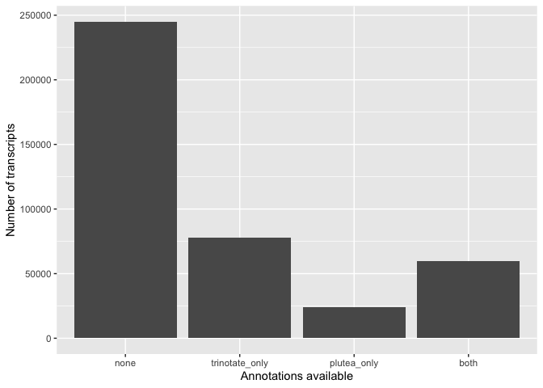
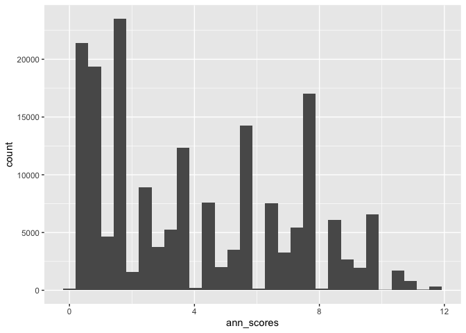

Functional Annotation
================
Ira Cooke
21/08/2017

``` r
library(tidyverse)
```

Our starting point are raw *P. cylindrica* transcriptome annotations
obtained from trinotate. To form our final annotation file we will; 1.
Cleanup the Trinotate annotations so that it is easy to access the best
blastx and blastp e-value per annotation. 2. Add InterproScan results to
trinotate annotations by merging on protein id 3. Merge these
annotations with annotations on highly similar genes in the *P. lutea*
genome. 4. Map transcript level annotations to Corset cluster level
annotations by choosing the best annotation per cluster.

## Preparing Trinotate Annotations

Trinotate annotations sometimes include many alternative blast hits per
transcript or protein. To reduce this down to a single “best” hit per
sequence we re-parse the raw blastx and blastp data and merge that back
into the Trinotate table.

``` r
full_trinotate <- read_tsv("hpc/trinotate/trinotate_annotation_report_nogenes.xls", na = ".") %>% 
  select(-sprot_Top_BLASTX_hit,-sprot_Top_BLASTP_hit)


blastx_proteins <-read_tsv("hpc/trinotate/blastx.outfmt6", col_names = FALSE) %>% 
  select(transcript_id = X1,blastx=X2,evalue_blastx=X11) %>% 
  filter(evalue_blastx<1e-5) %>% 
  group_by(transcript_id) %>% slice_min(evalue_blastx, n=1, with_ties=FALSE)

blastp_proteins <-read_tsv("hpc/trinotate/blastp.outfmt6", col_names = FALSE) %>% 
  select(prot_id=X1,blastp=X2,evalue_blastp=X11) %>% 
  filter(evalue_blastp<1e-5) %>% 
  group_by(prot_id) %>% slice_min(evalue_blastp, n=1, with_ties=FALSE)

clean_trinotate <- full_trinotate %>% 
  left_join(blastx_proteins) %>% 
  left_join(blastp_proteins) 
```

## InterproScan

``` r
ipro_data <- read_tsv("hpc/interpro/PdPf_transfuse95.tsv",
                      col_names = c("prot_id","md5","seqlen","analysis","signature_acc","signature_desc","start","stop","score","status","date","ipr_acc","ipr_ann","ipr_go", "pathways"),guess_max = 10000)

collapse_go <- function(goterms){
  tmp <- goterms %>% str_split("\\|") %>% unlist() 
  tmp <- tmp[!is.na(tmp)]
  paste(unique(tmp),collapse = ";")
}

interpro_go <- ipro_data %>% 
  group_by(prot_id) %>% 
  filter(score<1e-5) %>% 
  mutate(ipr_go = collapse_go(ipr_go)) %>% 
  filter(analysis=="Pfam") %>% 
  summarise(ipro_pfam = collapse_go(signature_acc), ipro_pfam_desc = collapse_go(signature_desc), ipr_go = unique(ipr_go))
```

## Inferring annotations based on Porites lutea gene models

The *Porites lutea* genome provides high quality gene models which in
turn may provide a better hit to annotation databases. To map these to
the *Porites cylindrica* transcriptome we performed a blastx search of
*P. cylindrica* transcripts against the *P. lutea* genome database in
Geneious.

To ensure that we only transfer annotations for *P. lutea* genes that
are highly similar to transcripts we filter the blast search results to
retain only those with pairwise identity of 90% and query coverage of
50%. These constraints also (incidentally) ensure a minimum e-value of
1e-25.

``` r
genome_blast_data <- read_csv("hpc/Annotation/blast_plutea/GenomeBlast_P.cylindrica_vs_P.lutea.csv") %>% 
  mutate(qcov=parse_number(`Query coverage`)) %>% 
  mutate(grade=parse_number(Grade)) %>% 
  mutate(pairwise_identity = parse_number(`% Pairwise Identity`)) %>% 
  filter(qcov>50) %>% filter(pairwise_identity>90) %>% 
  select(plutea_id=Name,transcript_id=Query,plutea_to_transcript_evalue=`E Value`,plutea_to_transcript_grade=grade)
```

For these high quality matches we then fetch *P lutea* annotations
(based on a Trinotate protocol).

``` r
blastx_proteins_lutea<- read.delim("hpc/Annotation/blast_plutea/plut2v1.1.proteins.blastx.outfmt6",header=FALSE,sep="") %>% 
  select(plutea_id=V1,blastx_lutea=V2,evalue_blastx_lutea=V11) %>% 
  filter(evalue_blastx_lutea<1e-5) %>% 
  group_by(plutea_id) %>% slice_min(evalue_blastx_lutea, n=1, with_ties=FALSE)

blastp_proteins_lutea<- read.delim("hpc/Annotation/blast_plutea/plut2v1.1.proteins.blastp.outfmt6",header=FALSE,sep="") %>% 
  select(plutea_id=V1,blastp_lutea=V2,evalue_blastp_lutea=V11) %>% 
  filter(evalue_blastp_lutea<1e-5) %>% 
  group_by(plutea_id) %>% slice_min(evalue_blastp_lutea, n=1, with_ties=FALSE)

signalp_lutea<- read.delim("hpc/Annotation/blast_plutea/plut2v1.1.proteins.signalp.out",header=FALSE,sep="", comment.char = "#") %>% 
  select(plutea_id = V1,signalp_score_lutea=V6,signalp_lutea=V9)

genome_blast_data_plutea_anno <- blastx_proteins_lutea %>% 
  full_join(blastp_proteins_lutea) %>% 
  full_join(signalp_lutea) %>% 
  right_join(genome_blast_data)
```

These annotated *P lutea* genes are then joined with the *P. cylindrica*
annotated transcripts and Interproscan annotations

``` r
cylindrica_transcriptome_all <- left_join(clean_trinotate,genome_blast_data_plutea_anno,by="transcript_id") %>% 
  left_join(interpro_go)
```

## Annotation summary

``` r
cylindrica_transcriptome_all %>% 
  mutate(has_trinotate = ifelse(is.na(blastp) & is.na(blastx),FALSE,TRUE)) %>% 
  mutate(annotation_cat = ifelse(has_trinotate & !is.na(plutea_id),"both",NA)) %>% 
  mutate(annotation_cat = ifelse(has_trinotate & is.na(plutea_id),"trinotate_only",annotation_cat)) %>% 
  mutate(annotation_cat = ifelse(!has_trinotate & is.na(plutea_id),"none",annotation_cat)) %>% 
  mutate(annotation_cat = ifelse(!has_trinotate & !is.na(plutea_id),"plutea_only",annotation_cat)) %>% 
  mutate(annotation_cat = factor(annotation_cat, levels = c("none","trinotate_only","plutea_only","both"), ordered=TRUE)) %>% 
  ggplot() +
  geom_bar(aes(x=annotation_cat)) + xlab("Annotations available") + ylab("Number of transcripts")
```

<!-- -->

## Merging annotations for Corset clusters

When interpreting gene expression data from Corset, our count values
will be assigned to Corset clusters but annotation information from
Trinotate is available for individual transcripts. Although a mapping is
available at the identifier level we need to reconcile situations where
multiple annotations are available for a single corset cluster. The
overall process is as follows;

``` r
cluster_data <- read.delim("hpc/corset/03-clusters.txt",stringsAsFactors = FALSE, header = FALSE)
names(cluster_data) <- c("transcript_id","cluster_id")

counts <- read_tsv("hpc/corset/03-counts.txt") %>% dplyr::rename(cluster_id=X1)
```

Join trinotate annotations and corset clusters based on `transcript_id`.
The result of this join is that we will now have multiple entries for
each Corset cluster.

``` r
cluster_data_counts <- counts %>% left_join(cluster_data,by="cluster_id")

ann_cluster_data <- cluster_data_counts %>% left_join(cylindrica_transcriptome_all, by="transcript_id")
```

In order to reduce the data down to one entry per Corset cluster our aim
is to pick the best annotated entry. To facilitate this we create a
column with an annotation score as follows; - The number of non-empty
columns in the annotation file. - The ratio of the peptide length to
transcript length multiplied by 3.

This score is designed to give most weight to extensive annotations and
then secondarily to full coverage of the transcript by the translated
peptide

``` r
# This is to create a row "score" which is higher for better annotated transcripts.
ann_scores <- apply(ann_cluster_data %>% select(Pfam,SignalP,TmHMM,eggnog,Kegg,gene_ontology_blast,blastx,blastp,blastx_lutea,blastp_lutea,ipr_go,ipro_pfam),1,function(row){
  sum(!is.na(row))
})

# Adding to the score the length of the transcript and predicted protein
ann_cluster_data_scored <- cbind(ann_cluster_data,ann_scores) %>% 
  group_by(cluster_id) %>% 
  mutate(ts_len = str_length(transcript)/max(str_length(transcript))) %>% 
  mutate(pep_len = str_length(peptide)/str_length(transcript)) %>% 
  mutate(ann_scores=ann_scores+pep_len+0.5*ts_len)
```

``` r
ann_cluster_data_scored %>% 
  ggplot() + geom_histogram(aes(x=ann_scores))
```

<!-- -->

If after this there are still entries with equal scores one is simply
picked at random to ensure one annotation entry per cluster.

``` r
# Now we pick the row with the top score.  If there are multiple rows with the same score just pick one at random
reag_ann_cluster_data <- ann_cluster_data_scored %>% 
  group_by(cluster_id) %>% 
  slice_max(ann_scores, with_ties=FALSE) %>% 
  select(-PdLa,-PdLb, -PdLc,-PdLd,-PdLe, -PdC, -PfLa, -PfLb, -PfLc, -PfLd, -PfLe, -PfC)
```

## Swissprot Annotation Information

Some additional useful information about each of the annotations is
available via Swissprot. To incorporate this into the annotation we must
first pick a “best” swissprot identifier for each cluster. Our logic in
making this choice is; 1. If blastx or blastp hits to the P. cylindrica
transcripts are available choose the one with the best e-value 2. If the
only annotation available is from P. lutea then choose the hit with best
blastx or blastp e-value for this

``` r
reag_ann_cluster_data_bestsp <- reag_ann_cluster_data %>% 
  ungroup() %>% 
  mutate(best_swissprot = ifelse(is.na(evalue_blastp) & !is.na(evalue_blastx),   blastx,NA)) %>% 
  mutate(best_swissprot = ifelse(!is.na(evalue_blastp) & is.na(evalue_blastx) ,   blastp, best_swissprot)) %>% 
  mutate(best_swissprot = ifelse(!is.na(evalue_blastp) & !is.na(evalue_blastx) & (evalue_blastp>evalue_blastx), blastx, best_swissprot)) %>%   
  mutate(best_swissprot = ifelse(!is.na(evalue_blastp) & !is.na(evalue_blastx) & (evalue_blastp<evalue_blastx), blastp, best_swissprot)) %>%   
  mutate(best_swissprot = ifelse(is.na(best_swissprot) & !is.na(evalue_blastp_lutea) & is.na(evalue_blastx_lutea), as.character(blastx_lutea), best_swissprot)) %>% 
  mutate(best_swissprot = ifelse(is.na(best_swissprot) & !is.na(evalue_blastx_lutea) & is.na(evalue_blastp_lutea), as.character(blastp_lutea), best_swissprot)) %>% 
  mutate(best_swissprot = ifelse(is.na(best_swissprot) & !is.na(evalue_blastx_lutea) & !is.na(evalue_blastp_lutea) & (evalue_blastp_lutea<evalue_blastx_lutea), as.character(blastp_lutea), best_swissprot)) %>% 
  mutate(best_swissprot = ifelse(is.na(best_swissprot) & !is.na(evalue_blastx_lutea) & !is.na(evalue_blastp_lutea) & (evalue_blastp_lutea>evalue_blastx_lutea), as.character(blastx_lutea), best_swissprot))

#write_tsv(select(reag_ann_cluster_data_bestsp,best_swissprot),"cache/best_swissprot.tsv")

swissprot_results <- readxl::read_excel("raw_data/uniprot-yourlist_M202011038471C63D39733769F8E060B506551E12034541F.xlsx",guess_max = 10000) %>% dplyr::select(Entry,Entry_name=`Entry name`,Protein_names=`Protein names`,Gene_names=`Gene names`,swissprot_go=`Gene ontology IDs`,Organism,Keywords)


final_annotated_clusters <- reag_ann_cluster_data_bestsp %>% left_join(swissprot_results,by=c("best_swissprot"="Entry_name"))
```

``` r
#write file with annotated transcriptome
saveRDS(final_annotated_clusters,file = "raw_data/annotated_clusters_porites.rda")
```
