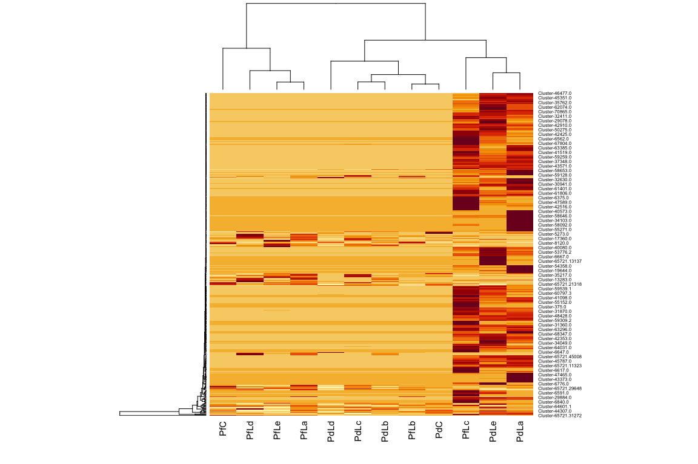
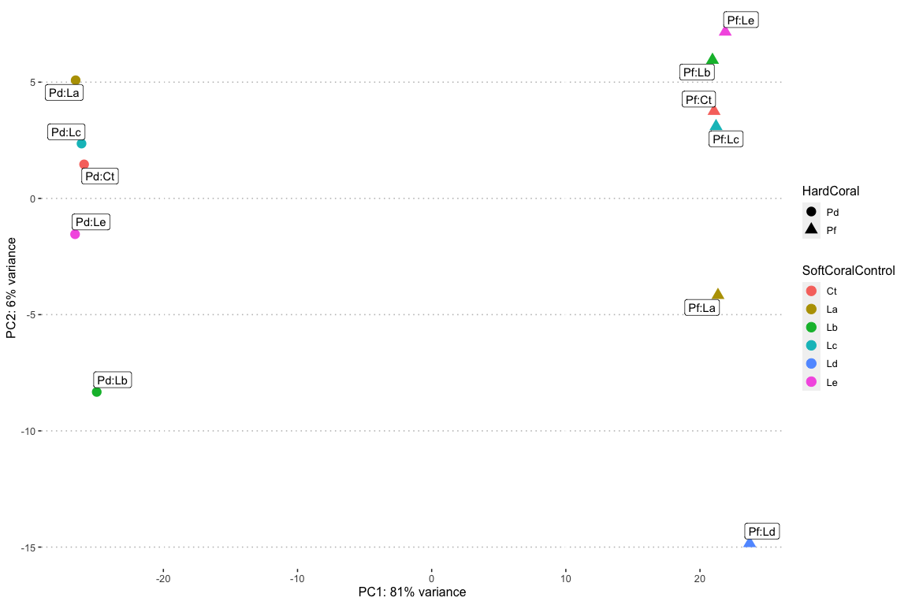
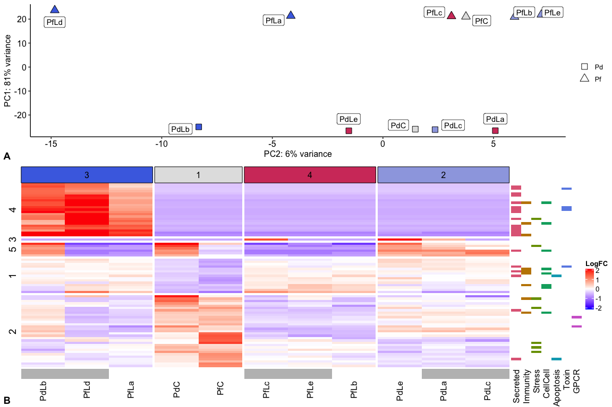

DESeq analysis
================
Natalia Andrade and Ira Cooke
07/08/2017

Counts obtained from Corset were analysed with DESeq to identify
differentially expressed genes between HardCoral treatments.

Next we identify cluster ids that correspond to Symbiont or Barnacle
transcripts

Initial data exploration with PCA revealed that PdLd is an extreme
outlier. We therefore excluded this sample from further analysis. We
also can see from the Barnacle counts that these were heavily
concentrated in three samples suggesting that only these three samples
were infected with coral-inhabiting barnacles.

<!-- -->

Differential Expression Analysis with the outlier excluded was then
performed based on a model with no intercept and a separate coefficient
for each level of the variable `HardCoralTrt`. This model gives us
maximum flexibility for statistical testing using different contrasts.

> ~ 0+HardCoralTrt

One issue with the above analysis is that it estimates a separate value
for each of the control samples, meaning that each such estimate will be
done without replicates. Perhaps a better model to capture this
experiment would be to estimate a treatment effect, a hard coral effect,
and their interaction

    ## [1] "HardCoralTrtC"    "HardCoralTrtPd_T" "HardCoralTrtPf_T"

Before proceeding with contrasts we first check a PCA with the outlier
excluded. This shows very clearly that Porites genotype is the dominant
source of variation in the data, accounting for 89%. PC2 accounts for
just 5% of variation and captures differences due to the competing
Lobophytum colony and whether competition exists at all (Control).

<!-- -->

To set up contrasts we first use `resultsNames()` to extract a list of
fitted coefficients in the model

    ## [1] "HardCoralTrtC"    "HardCoralTrtPd_T" "HardCoralTrtPf_T"

Based on this the following contrast should highlight genes consistently
different between control and treatment

`contrast_ct <- c(1,-0.5,-0.5)` which captures genes consistently
different between treatment and control across both Porites colonies

For the top genes differentially expressed between control and treatment
scatterplots of the raw data provide a useful check that the statistical
analysis identifies genuine differentially expressed transcripts.

<!-- -->

Now a heatmap for all the DE genes between treatment and control. For
this the relative change in expression is plotted (relative to the mean
for a gene) so that clustering is meaningful. The clusters reveal some
interesting patterns in terms of samples (matching the PCA) and in terms
of genes (identifying alternative types of molecular response to
competition).

    ## [1] "#4A6FE3" "#9DA8E2" "#E2E2E2" "#E495A5" "#D33F6A"

<!-- -->
