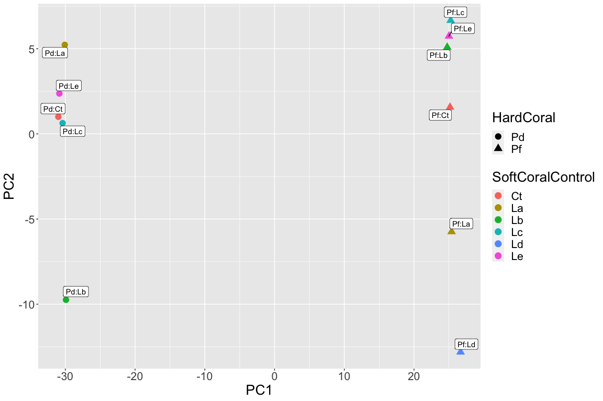
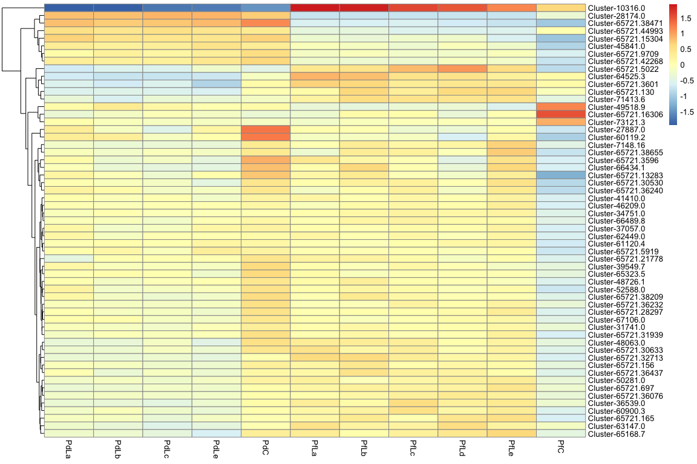

DESeq analysis
================

Counts obtained from Corset were analysed with DESeq to identify
differentially expressed genes between HardCoral treatments.

Initial data exploration with PCA revealed that PdLd is an extreme
outlier. We therefore excluded this sample from further analysis

Differential Expression Analysis with the outlier excluded was then
performed based on a model including the treatment, HardCoral and their
interaction

> ~ treat\*HardCoral

    ## [1] "Intercept"          "treat_T_vs_C"      
    ## [3] "HardCoral_Pf_vs_Pd" "treatT.HardCoralPf"

<!-- -->

For genes differentially expressed between control and treatment we plot
raw values as scatterplots

<!-- -->

Now plot raw data as heatmaps. For this the relative change in
expression is plotted (relative to the mean for a gene) so that
clustering is meaningful

<!-- -->

Plot a heatmap for genes with significant interactions. This is
interesting because it seems to indicate that there are many genes where
Pf upregulates the gene in interaction relative to control whereas Pd
does not.

<!-- -->
