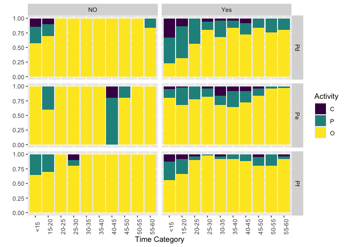

Polyp Activity. Plots and Final Statistics
================
Rhondda Jones, Natalia Andrade and Ira Cooke
29/08/2017

This is a ggplot equivalent of of the Mosaicplots used in data
exploration. This shows data aggregated across nubbins and tanks which
does hide some important variation that is hard to capture graphically
(see stats). Overall however there are two clear trends;

1.  The treated colonies are more likely to be partial or closed than
    controls
2.  Colonies seemed to be more likely to be partial or closed at the
    start of the trial and gradually converted to open as the trial
    progressed.

<!-- -->

Based on extensive model selection analysis (see
[03\_polyp\_activity\_exploration.md](03_polyp_activity_exploration.md))
a generalised cumulative mixed effects model was chosen to fit the polyp
activity data.

    ## Cumulative Link Mixed Model fitted with the Laplace approximation
    ## 
    ## Call:
    ## clmm2(location = Activity ~ TimeCat + TREAT + HARD, random = TANK, 
    ##     data = polyp_act_long, Hess = TRUE)
    ## 
    ## Random effects:
    ##            Var  Std.Dev
    ## TANK 0.4648676 0.681812
    ## 
    ## Location coefficients:
    ##              Estimate Std. Error z value Pr(>|z|)  
    ## TimeCat15-20  0.2089   0.2017     1.0358 0.30031348
    ## TimeCat20-25  1.4298   0.2371     6.0314 1.6256e-09
    ## TimeCat25-30  2.0754   0.2793     7.4314 1.0745e-13
    ## TimeCat30-35  1.2912   0.3131     4.1240 3.7242e-05
    ## TimeCat35-40  1.5622   0.3290     4.7476 2.0581e-06
    ## TimeCat40-45  1.0310   0.2955     3.4884 0.00048592
    ## TimeCat45-50  1.7337   0.3464     5.0052 5.5816e-07
    ## TimeCat50-55  1.9666   0.3649     5.3886 7.1024e-08
    ## TimeCat55-60  2.2797   0.3735     6.1040 1.0345e-09
    ## TREATYes     -1.0133   0.3833    -2.6434 0.00820717
    ## HARDPe        1.1508   0.3321     3.4652 0.00052988
    ## HARDPf        1.0932   0.3309     3.3035 0.00095495
    ## 
    ## No scale coefficients
    ## 
    ## Threshold coefficients:
    ##     Estimate Std. Error z value
    ## C|P -2.3882   0.4236    -5.6378
    ## P|O -0.3083   0.4133    -0.7459
    ## 
    ## log-likelihood: -807.071 
    ## AIC: 1644.142 
    ## Condition number of Hessian: 79.14231 
    ## (574 observations deleted due to missingness)
