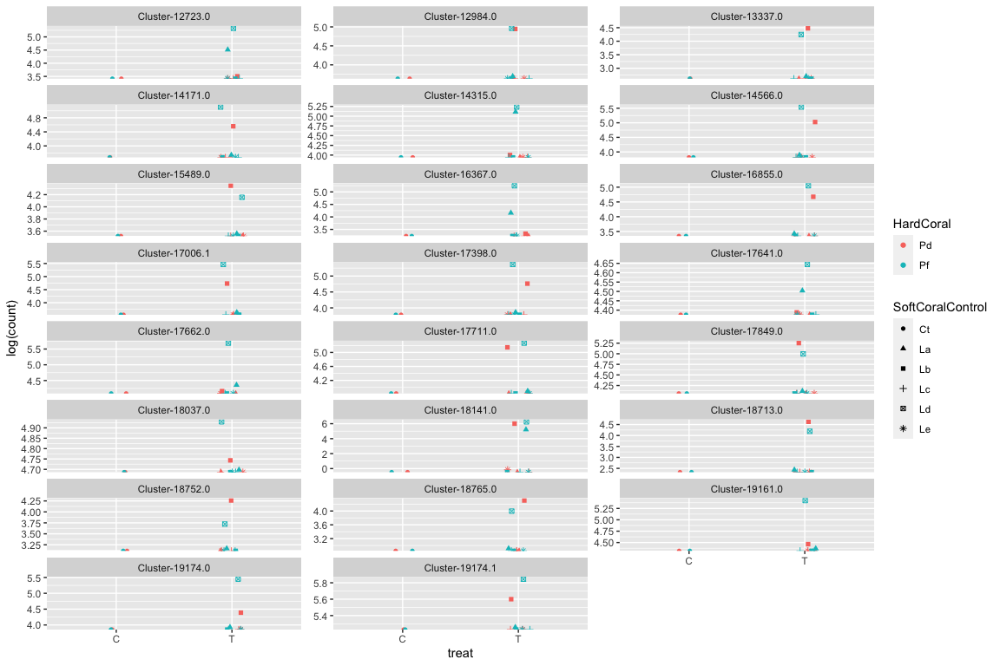
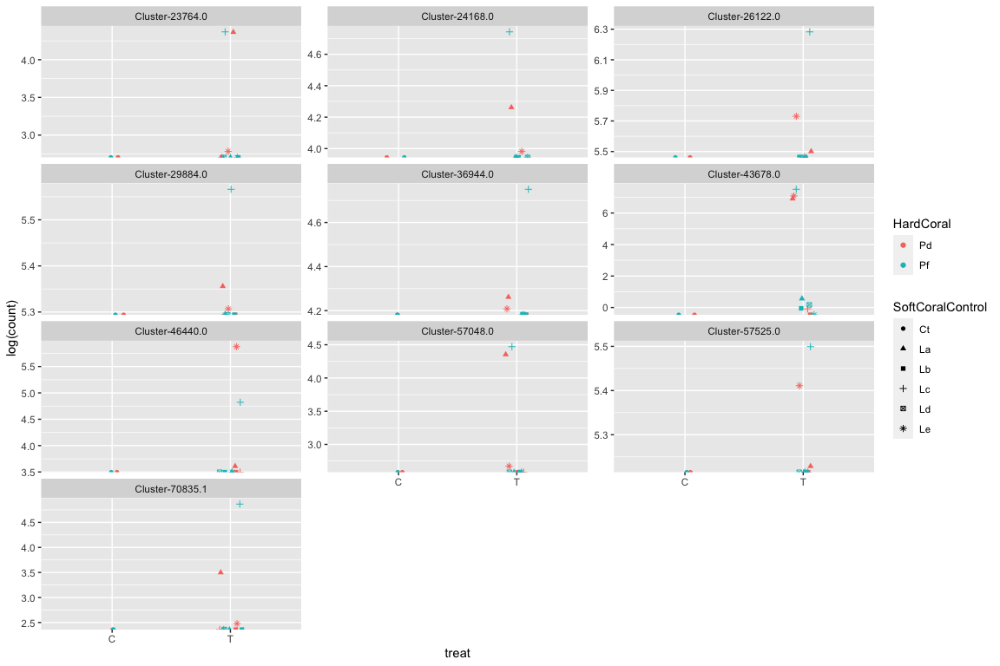
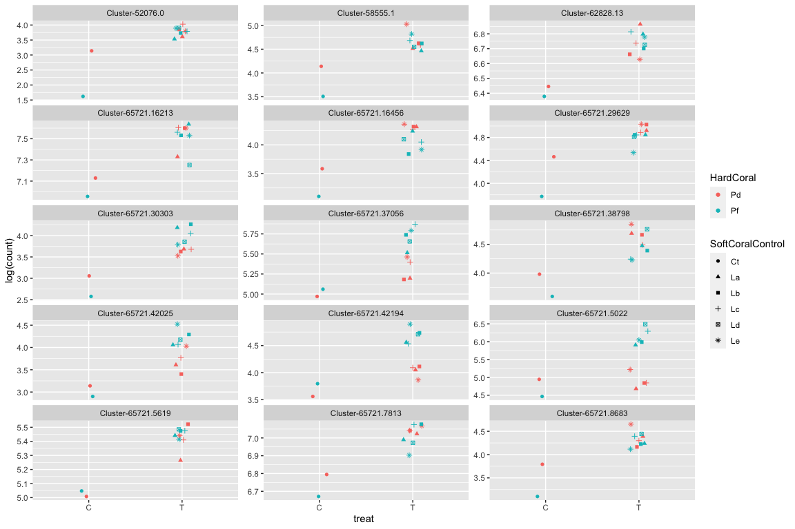
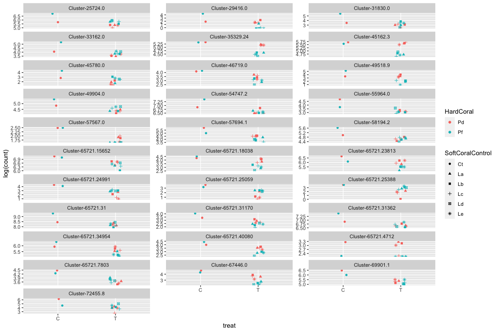
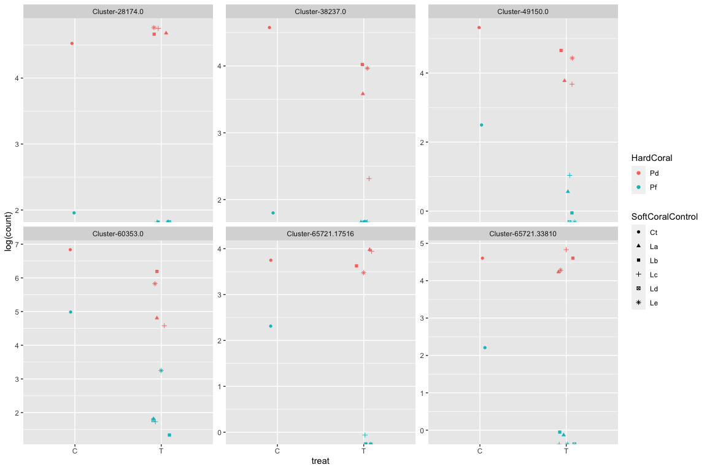
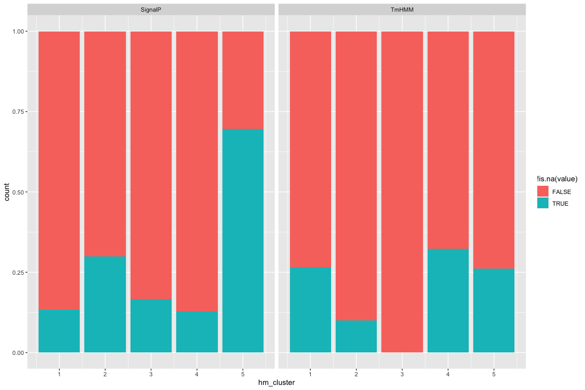

Gene function analysis
================
Natalia Andrade and Ira Cooke
07/08/2017

Gene function analysis is based on the following datasets; - Functional
annotations created in `01_annotate` for all clusters - Differential
expression analysis (from `02_deseq.Rmd`) to select genes DE between
control and treatment - Manual annotations created by curating automatic
annotations along with literature searches for DE genes - K-means
clustering groups which identify genes (Corset clusters) identified in
the heatmap (see `04_polyp_activity.Rmd`)

Our focus initially is on the genes differentially expressed between
control and treatment. Raw (normalised) counts for a handful of the top
genes are plotted here as a sanity check to ensure that they look
genuinely differentially expressed.

<!-- -->

## Function of genes in PCA clusters

Cluster 5 is expressed strongly in three samples and not expressed at
all in others. This cluster aligns well with the PCA. This cluster is
massively enriched in secreted proteins with 16 out of 23 having a
Signal peptide.

<!-- -->

    ## [1] 16

Cluster 2 represents the opposite end of the PCA. It has a similar
pattern except that three different samples are expressed in this case.
Of the 10 proteins in this cluster four are involved in oxidative
metabolism (homologues of COX1, CYB, COX3, COX2).

<!-- -->

Most genes in cluster 1 are expressed in all samples but generally seem
up in competition compared with control.

<!-- -->

Cluster 4 contains genes with reduced expression in competition compared
to controls.

<!-- -->

Genes in cluster 3 don’t fit into any of the above categories. In
general these genes have divergent expression between the two controls.
Although called as differentially expressed they have borderline
p-values.

<!-- -->

## GO Term Enrichment Analysis

Using GO terms obtained from Swissprot we performed a GO enrichment
analysis in two ways;

1.  Using the entire set of differentially expressed genes at the target
    set and all quantifiable clusters as the background
2.  Separately for each of the five heatmap row clusters

At a significance threshold of `p<0.01` we found 8 enriched GO terms (4
in BP, 2 in MF, 2 in CC) using all DEG as the target. By splitting
datasets according to heatmap rows this was increased to 14 enriched
terms (6 BP, 4MF, 4 CC). These enriched GO terms are driven by a
relatively small number of genes (11) with many GO terms forming part of
the same (or similar) gene annotation.

Aside from GO terms we can also examine enrichment for basic attributes.
This reveals that Cluster 5 is massively enriched for secreted proteins
(via SignalP).

<!-- -->

Attempts to find patterns in Kegg Orthology (KO) were fruitless as all
annotated proteins have unique values.

    ## # A tibble: 25 x 3
    ##    Kegg              proteins                          count
    ##    <chr>             <chr>                             <int>
    ##  1 <NA>              Allene oxide synthase-lipoxygena…    59
    ##  2 KEGG:cfa:403812`… Histamine H2 receptor (H2R) (HH2…     2
    ##  3 KEGG:hsa:83872`K… Hemicentin-1 (Fibulin-6) (FIBL-6…     2
    ##  4 KEGG:aag:COX3`KO… Cytochrome c oxidase subunit 3 (…     1
    ##  5 KEGG:ame:406088   Vitellogenin                          1
    ##  6 KEGG:bsu:BSU3007… Glycine betaine transporter OpuD      1
    ##  7 KEGG:bta:537692   Metallo-beta-lactamase domain-co…     1
    ##  8 KEGG:dre:393420   UPF0696 protein C11orf68 homolog      1
    ##  9 KEGG:dse:CYTB`KO… Cytochrome b (Complex III subuni…     1
    ## 10 KEGG:dya:COX1`KO… Cytochrome c oxidase subunit 1 (…     1
    ## # … with 15 more rows
