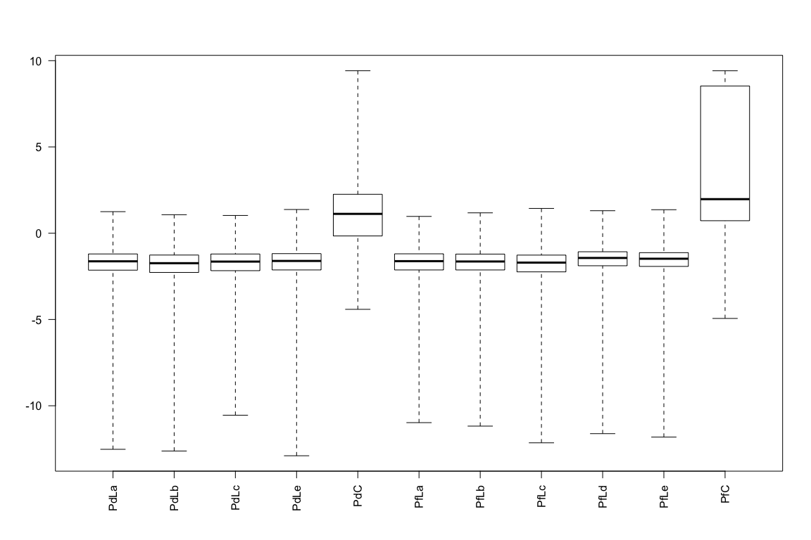
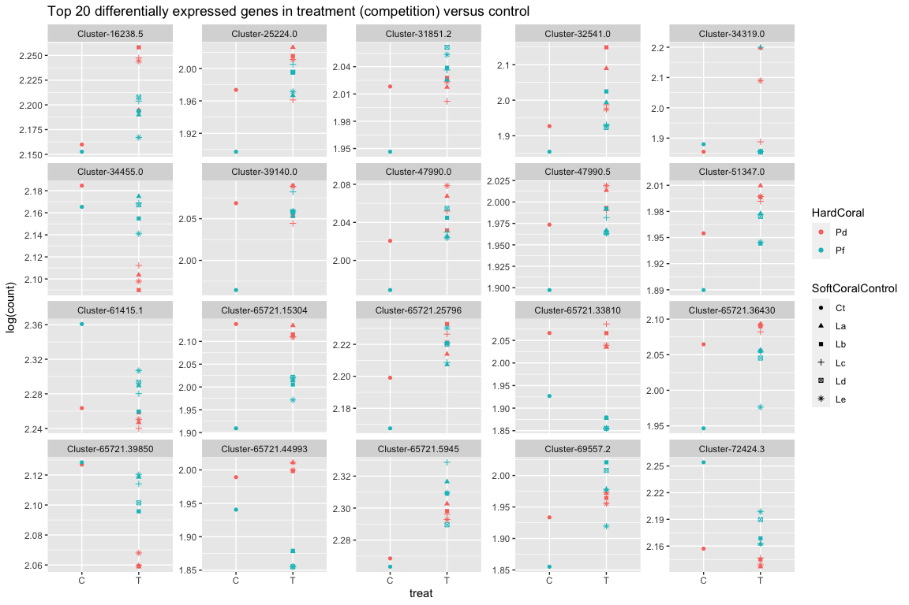
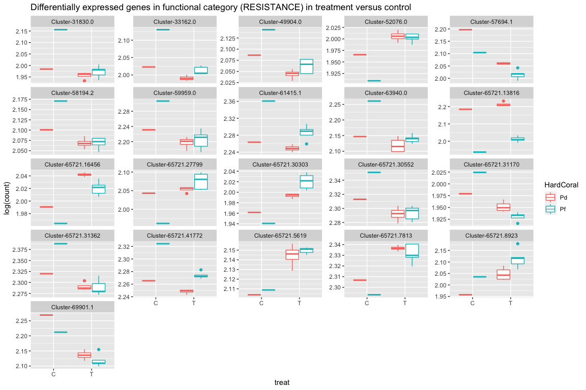
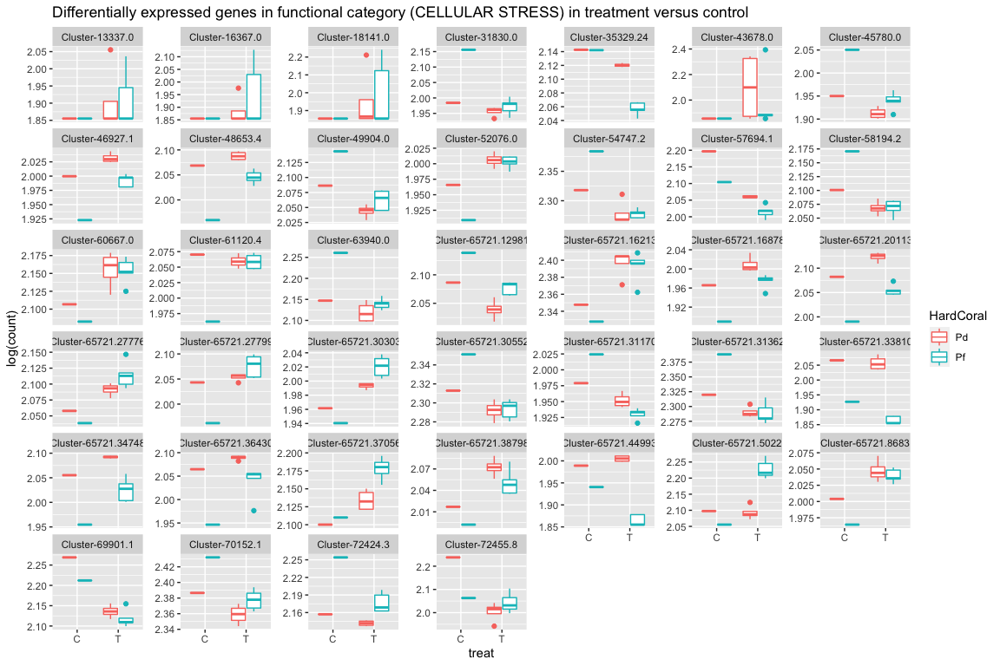

Gene function analysis
================
Natalia Andrade and Ira Cooke
07/08/2017

Load differentially expressed genes between HardCoral treatments obtain
data from analysis with DESeq2 (03\_deseq).

Annotating the 174 DEG\_CvsT with transcriptome annotation and manual
annotation

Plots showing the expression of genes in the different categories and
for the two
genotypes

<!-- --><!-- --><!-- --><!-- -->

Ploting expression of Lobophytum DEG and Porites DEG to show effect of
colony Pd

    ##  [1] "Cluster" "LdPe"    "LdPf"    "LdPd"    "LePe"   
    ##  [6] "Le"      "LePf"    "LePd"    "LcPe"    "Lc"     
    ## [11] "LcPf"    "LaPd"    "LcPd"    "La"      "LaPf"   
    ## [16] "LaPe"    "Lb"      "LbPe"    "LbPd"    "LbPf"   
    ## [21] "Ld"

<!-- -->
