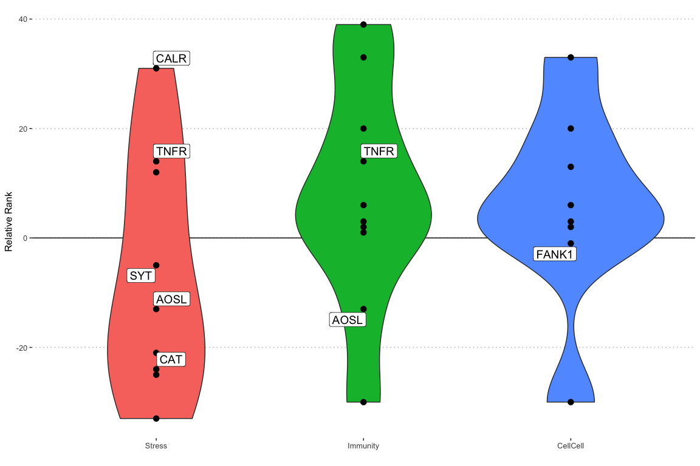

Gene function analysis
================
Natalia Andrade and Ira Cooke
07/08/2017

Gene function analysis is based on the following datasets; - Functional
annotations created in `01_annotate` for all clusters - Differential
expression analysis (from `02_deseq.Rmd`) to select genes DE between
control and treatment - Manual annotations created by curating automatic
annotations along with literature searches for DE genes - K-means
clustering groups which identify genes (Corset clusters) identified in
the heatmap (see `04_polyp_activity.Rmd`)

Our focus initially is on the genes differentially expressed between
control and treatment. Raw (normalised) counts for a handful of the top
genes are plotted here as a sanity check to ensure that they look
genuinely differentially expressed.

<!-- -->

<!-- -->

    ## # A tibble: 4 x 2
    ##   evidence_level count
    ##            <dbl> <int>
    ## 1              0    47
    ## 2              1     9
    ## 3              2    15
    ## 4              3     5
