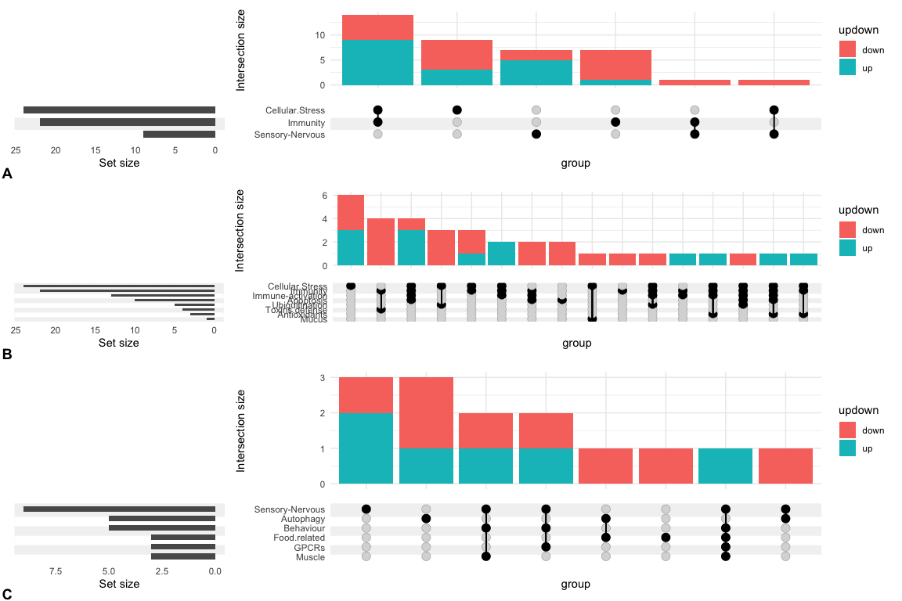

Gene function analysis
================
Natalia Andrade and Ira Cooke
07/08/2017

    ## [1] "Converting non-logical columns to binary: Sensory-Nervous, Immunity, Cellular.Stress"

\#CELLULAR.STRESS \#IMMUNE RESPONSE TO
    COMPETITION

    ## [1] "Converting non-logical columns to binary: Toxins.defense, Apoptosis, Immune-activation, Ubiquitination, Mucus, Antioxidants, Immunity, Cellular.Stress"

\#NERVOUS SYSTEM AND
    BEHAVIOUR

    ## [1] "Converting non-logical columns to binary: Behaviour, Muscle, GPCRs, Food.related, Autophagy, Sensory-Nervous"

\#In one plot
<!-- -->
