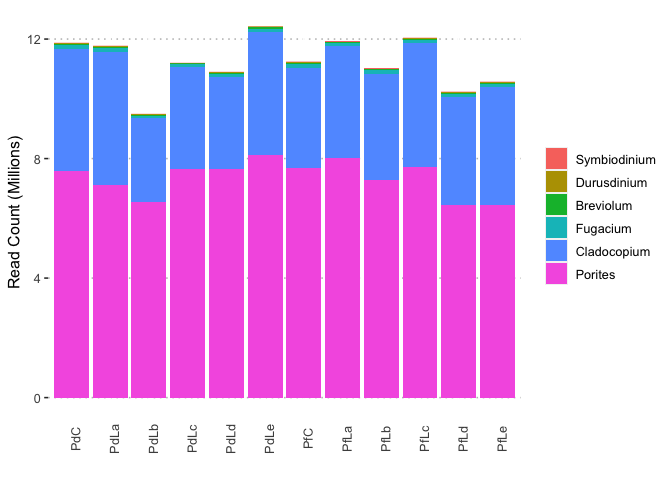

Kraken analysis
================

    ## 
    ## ── Column specification ────────────────────────────────────────────────────────
    ## cols(
    ##   ID = col_character(),
    ##   Tanks = col_character(),
    ##   HardCoral = col_character(),
    ##   treat = col_character(),
    ##   SoftCoralControl = col_character(),
    ##   PCA = col_character()
    ## )

    ## Joining, by = "sample"

Plot by absolute read counts

    ## Warning: package 'ggpubr' was built under R version 3.6.2

<!-- -->
